# Visualization
This directory will show you all the visualizations I made during my Master 2 internship.  
  
Warning :  
* All scripts and visualizations to be shared are exclusively **tailor-made for the WP1_chicken_blood_novo** project data and my path.
* All scripts are run locally

## Metadata analysis  
  
First, a visualization of the raw data distribution is performed with this R script : **[metadata.r](../script/visualization/metadata.r)**

  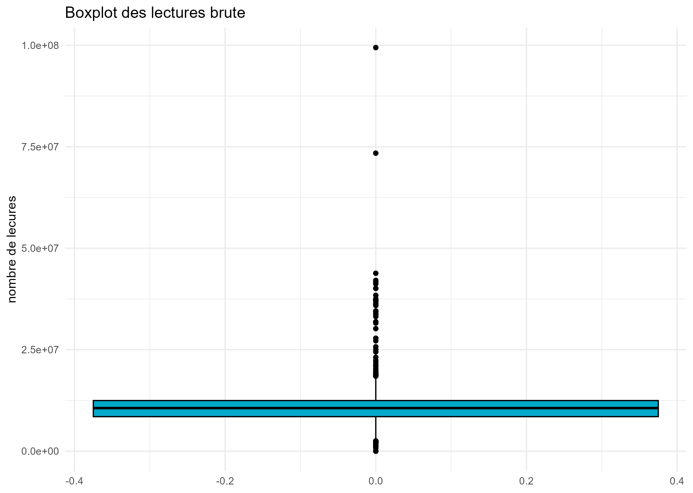
  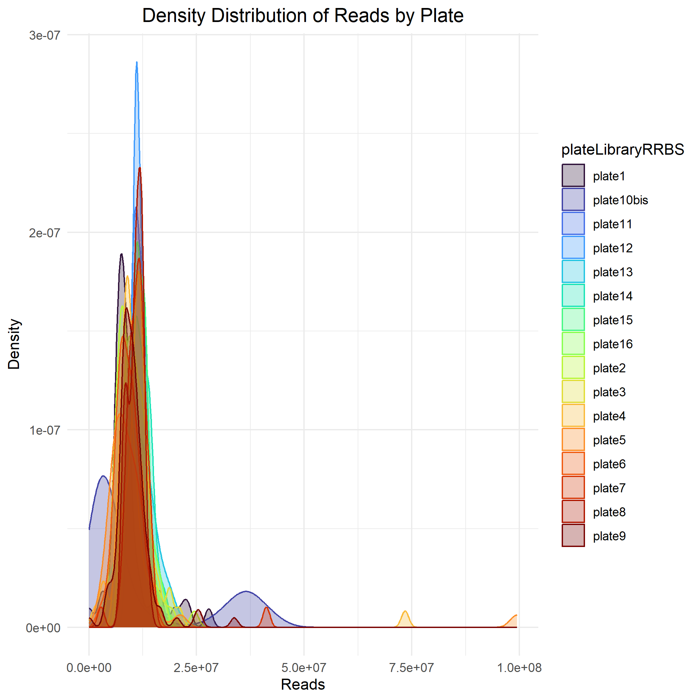
  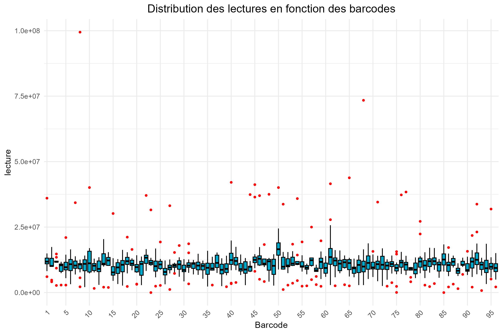

## Benchmarking maximum threshold

The custom threshold is then visualized with the script : **[benchmarking.r](../script/visualization/metadata.r)**

  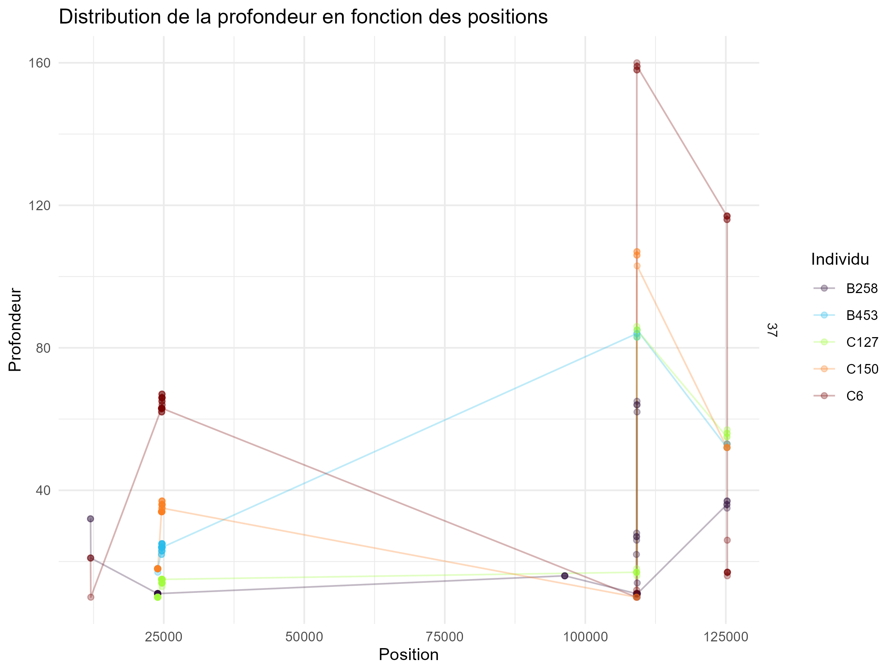
  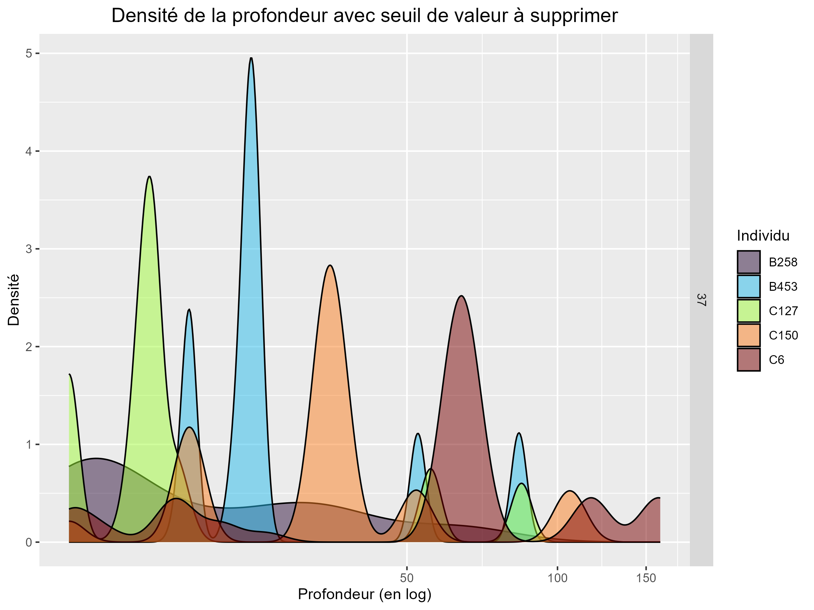
  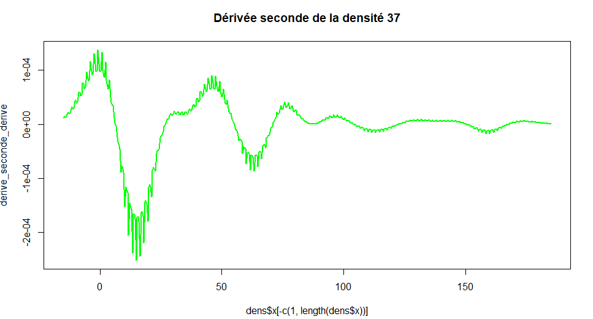

  

  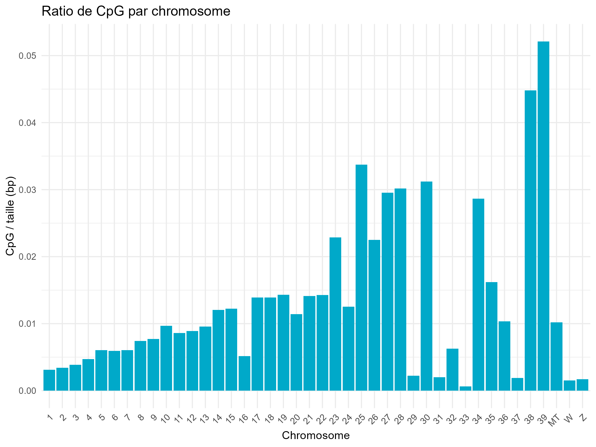

## View filters
Visualization of some statistics after the pipeline with the script : **[View_filter.r](../script/visualization/View_filter.r)**

  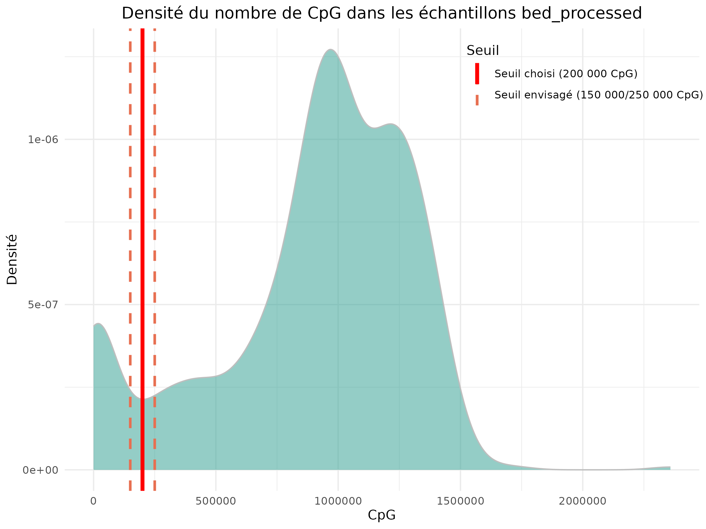
  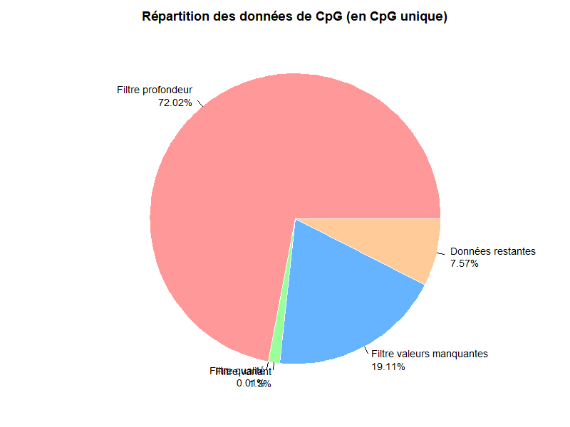

  
  
## Data characterization
Now that our data is clean, we can study it further with this script : **[characterization.r](../script/visualization/characterization.r)**

  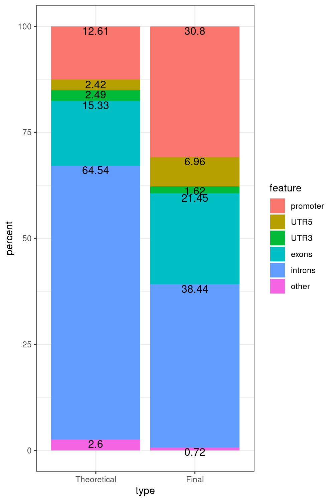
  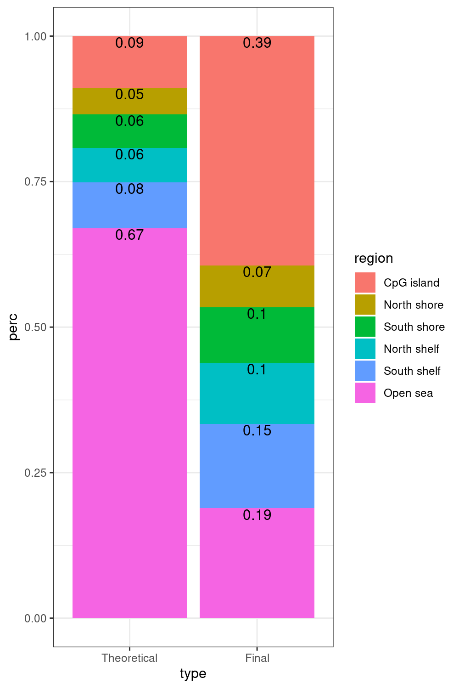

 

  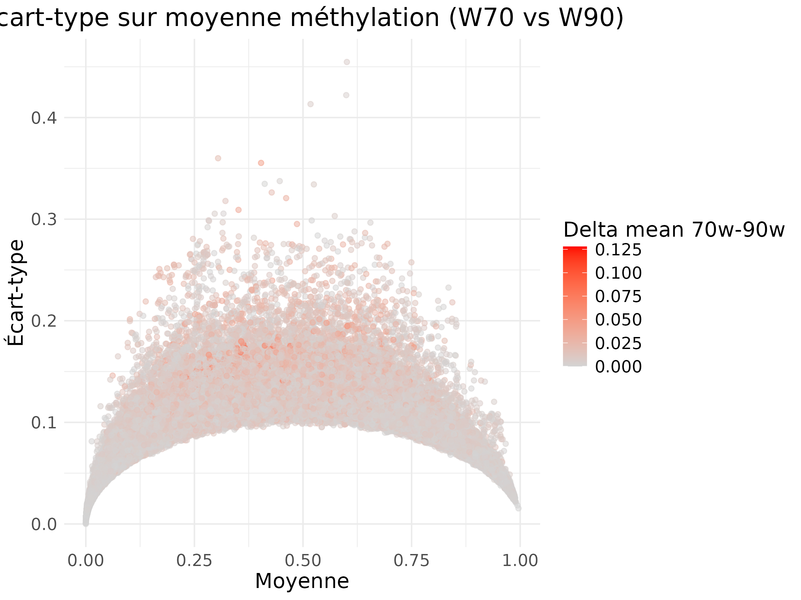
  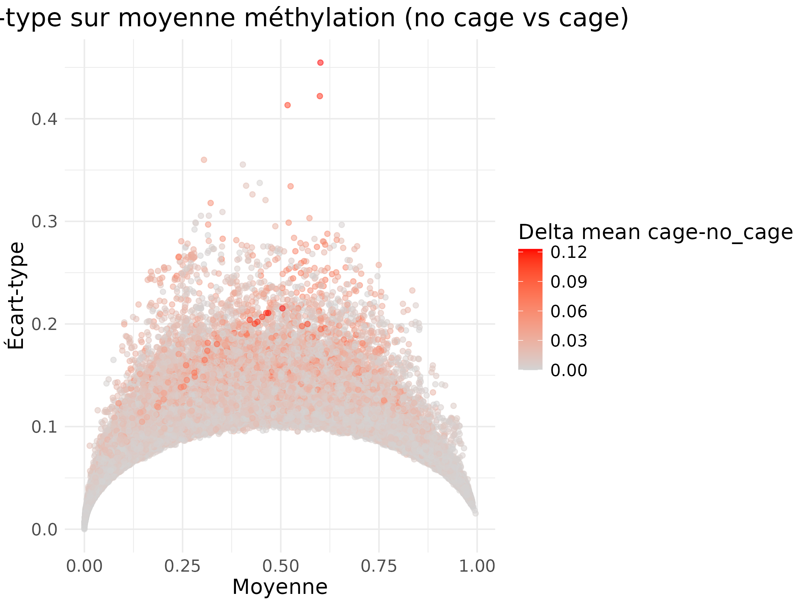

## DSS analysis